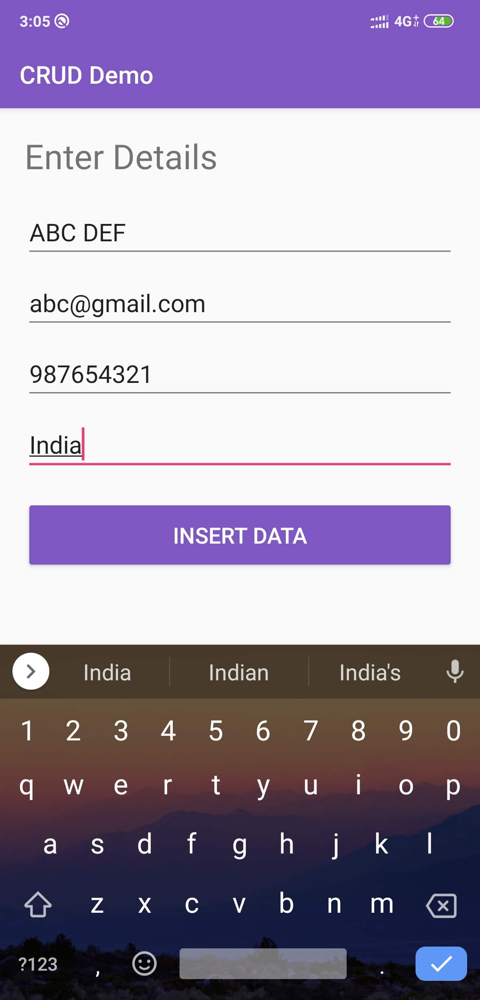
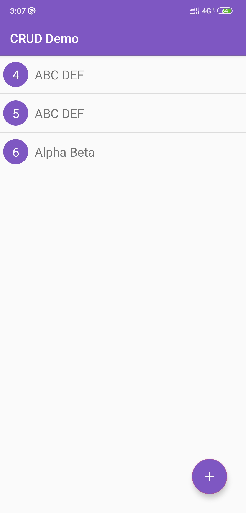
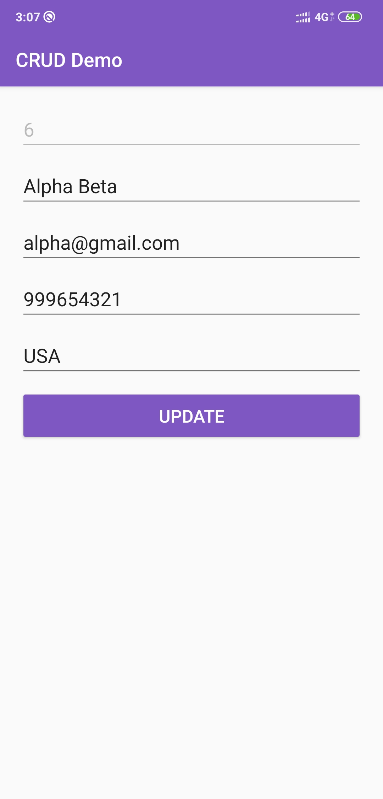
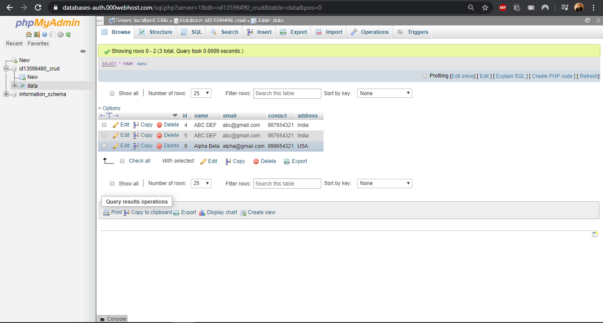
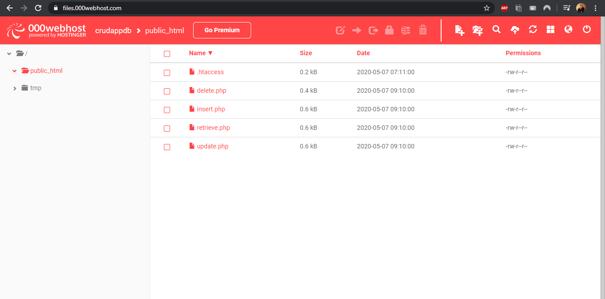

# CRUD-Demo
A android app to demonstrate CRUD operations using MYSQL, Volley, PHP. Hosted on https://in.000webhost.com/ 
 
 

<table>
  <tr>
    <td>INSERT</td>
    <td>HOME</td>
	<td>OPTIONS</td>
	<td>UPDATE</td>
  </tr>
  <tr>
    <td></td>
    <td></td>
	<td></td>
	<td></td>
  </tr>
 </table>
 

  
  
  
 

<table>
  <tr>
    <td>phpMyAdmin</td>
    <td>Scripts on Cloud</td>
  </tr>
  <tr>
    <td></td>
	<td></td>
  </tr>
 </table>
 
